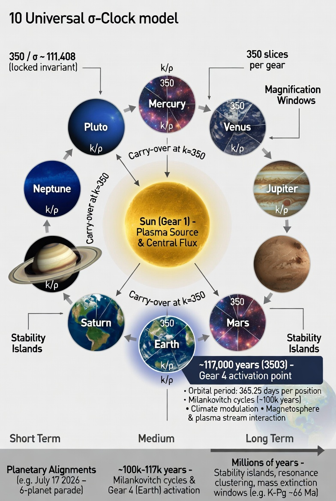

# Universal π Clock

A seven-gear cascading clock based on the **Egg of Life** sacred-geometry pattern (one central circle + six surrounding circles). Each gear tracks position on a 350-slice circumference labeled **k/π**, with carry-over to the next higher gear at full revolution.

## Preview



Background art: [commit a21316a](https://github.com/kinaar8340/universal_clock/commit/a21316a4c2a858a6f5fcb81ddbf8fda608291276)

## Layout

| Gear | Position | Color |
|------|----------|-------|
| 1 | Center (fastest) | Red |
| 2 | ~1 o'clock | Orange |
| 3 | ~3 o'clock | Gold |
| 4 | ~5 o'clock | Teal |
| 5 | ~7 o'clock | Steel blue |
| 6 | ~9 o'clock | Purple |
| 7 | ~11 o'clock | Deep indigo |

- **350 slices** per circle, labeled `1/π` … `350/π`
- **Fill** grows clockwise from 12 o'clock
- **Hand** points to the current slice on every gear
- At **k = 350**, the gear resets to 1 and carries +1 to the next gear

## Live demo (Hugging Face Space)

**https://huggingface.co/spaces/kinaar111/universal_clock**

Interactive Gradio app: batch advance, real-time Earth-rate mode, adjustable speed, slice lines, and hand indicators.

Deploy updates:

```bash
bash scripts/deploy_hf_space.sh
```

### HF deploy token

`hf auth login` does **not** take `--token-name`. Names come from Hugging Face when you store a token.

1. Add your `universal_clock_deploy` token (paste the `hf_…` value from [token settings](https://huggingface.co/settings/tokens)):

```bash
hf auth login --token hf_YOUR_TOKEN_HERE --force
```

2. Confirm it appears in the store:

```bash
hf auth list
```

3. If you have multiple tokens, switch to the deploy token:

```bash
hf auth switch --token-name universal_clock_deploy
```

4. Deploy:

```bash
bash scripts/deploy_hf_space.sh
```

One-off deploy without switching the default token:

```bash
HF_TOKEN=hf_YOUR_TOKEN_HERE hf upload kinaar111/universal_clock space --type space
```

## Quick start

```bash
cd ~/Projects/universal_clock
python3 -m venv .venv
source .venv/bin/activate
pip install -r requirements.txt
```

### Batch mode (instant PoC)

```bash
# Default: 5,000 ticks → G1=101, G2=15, G3–G7=1
python main.py

# Custom tick count
python main.py --ticks 50000

# Output path
python main.py --ticks 10000 --output output/advanced.png
```

### Real-time Earth mode

```bash
# True Earth rate (Gear 1 revolution = 86,400 s — one mean solar day)
python main.py --earth-rate

# Accelerated: watch carry propagate in seconds
python main.py --earth-rate --speed 1000

# Another planet: set Gear 1 revolution period in seconds
python main.py --earth-rate --rev-seconds 88775 --speed 500
```

Close the plot window or press **Ctrl+C** to stop real-time mode.

### Animation

```bash
python main.py --ticks 10000 --animate 60
```

Produces `output/egg_of_life_clock.gif` alongside the PNG.

## Python API

```python
from universal_clock import UniversalPiClock, render_clock
from universal_clock.realtime import run_realtime

# Batch
clock = UniversalPiClock()
clock.fast_forward(5000)
render_clock(clock, output="output/state.png")

# Real-time Earth (1000× speed for demo)
clock = UniversalPiClock()
clock.set_earth_rate(86400)
run_realtime(clock, speed_multiplier=1000)
```

### Manual real-time loop

```python
import time
from universal_clock import UniversalPiClock, render_clock

clock = UniversalPiClock()
clock.set_earth_rate(86400)

while True:
    if clock.tick_realtime(speed_multiplier=1000):
        render_clock(clock, output="output/live.png")
    time.sleep(0.01)
```

## CLI reference

| Flag | Description |
|------|-------------|
| `--ticks N` | Instant batch: advance N ticks, save PNG (default 5000) |
| `--earth-rate` | Real-time mode tied to wall clock |
| `--speed N` | Speed multiplier for real-time (default 1) |
| `--rev-seconds N` | Gear 1 full-revolution period (default 86400) |
| `--output PATH` | PNG output path (batch mode) |
| `--animate N` | Save GIF with N frames (batch mode) |
| `--no-hands` | Hide hand indicators |
| `--no-ticks` | Hide radial slice lines |
| `--slice-lines N` | Radial lines per circle (default 70; must divide 350) |
| `--no-labels` | Hide k/π circumference labels |

## Project structure

```
universal_clock/
├── universal_clock/
│   ├── clock.py       # UniversalPiClock logic + real-time ticking
│   ├── visualize.py   # Egg of Life renderer + hand indicators
│   ├── realtime.py    # Interactive matplotlib loop
│   └── animate.py     # GIF export
├── main.py            # CLI entry point
├── tests/
└── output/            # Generated images (gitignored)
```

## Scaling to other worlds

Gear 1 speed sets the planetary “day.” All higher gears cascade automatically:

```python
# Mars sol ≈ 88,775 s
clock.set_earth_rate(88775)

# Jupiter cloud-top rotation ≈ 35,700 s
clock.set_earth_rate(35700)
```

The visual language stays identical — only the tick interval changes.

## License

MIT — see [LICENSE](LICENSE).